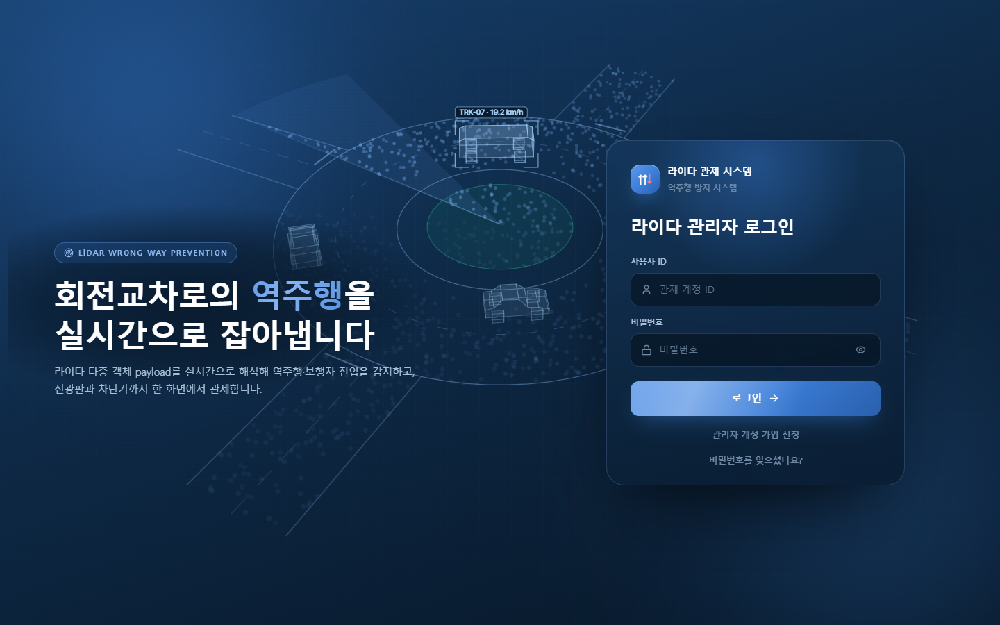
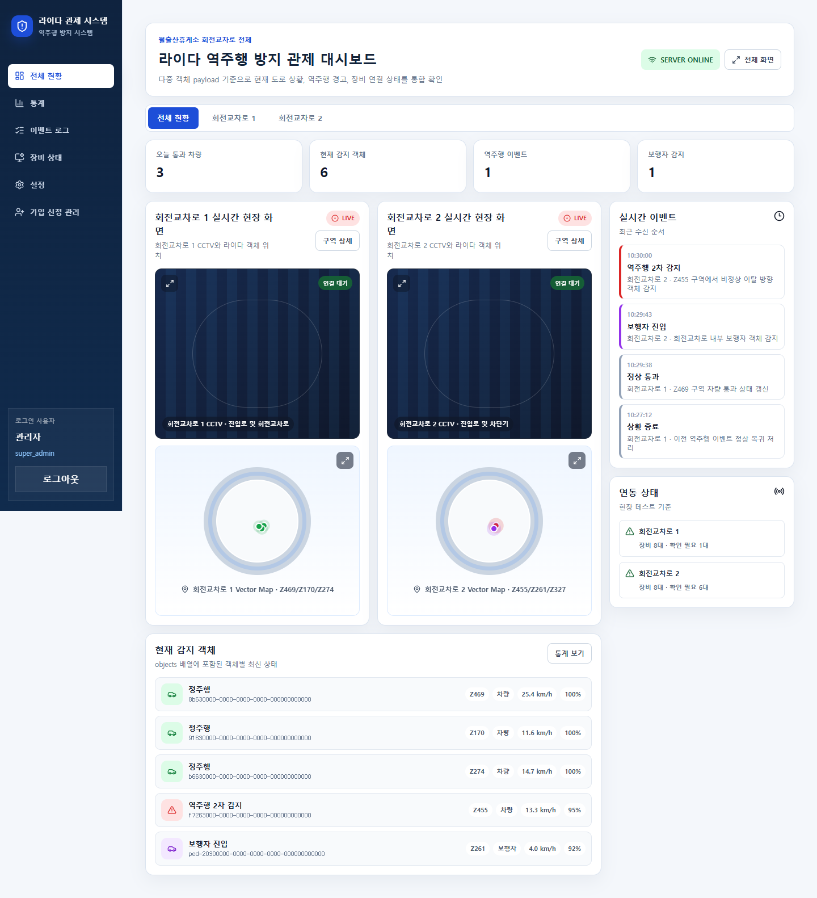
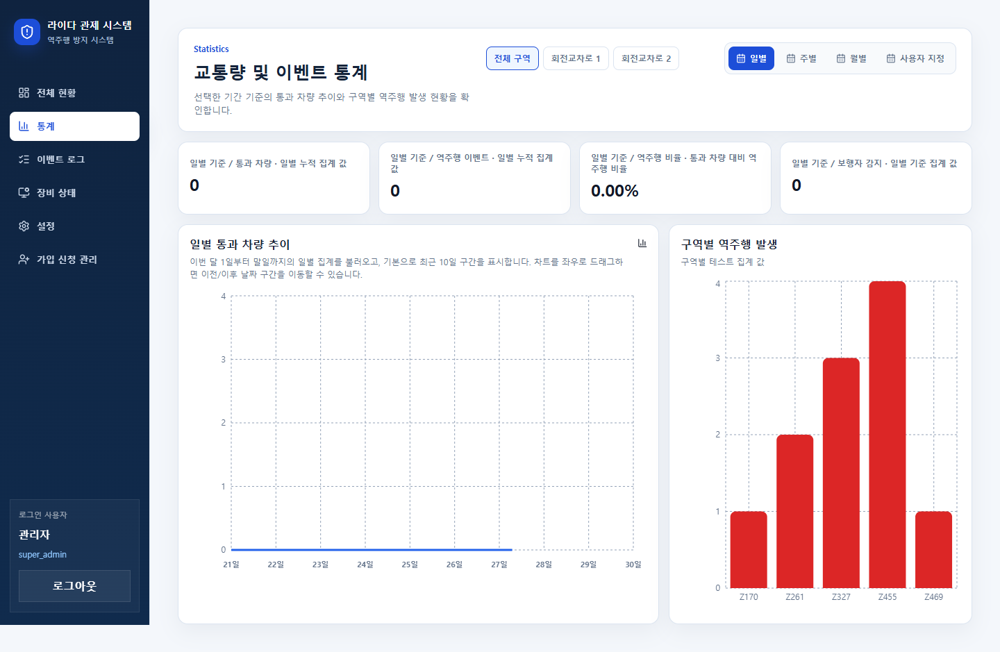
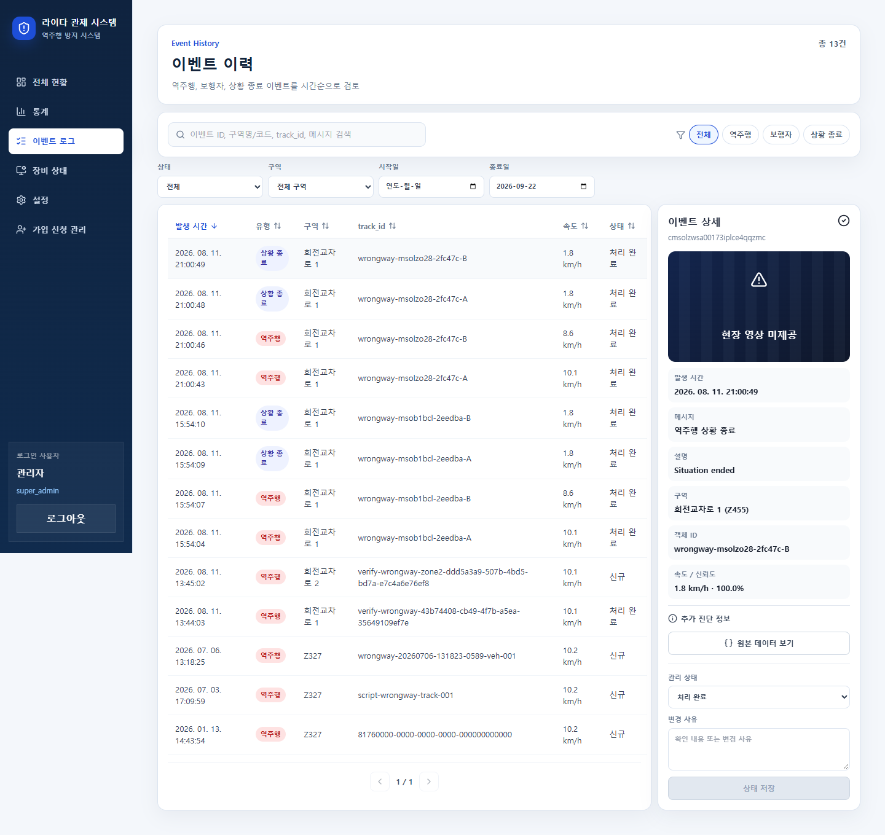
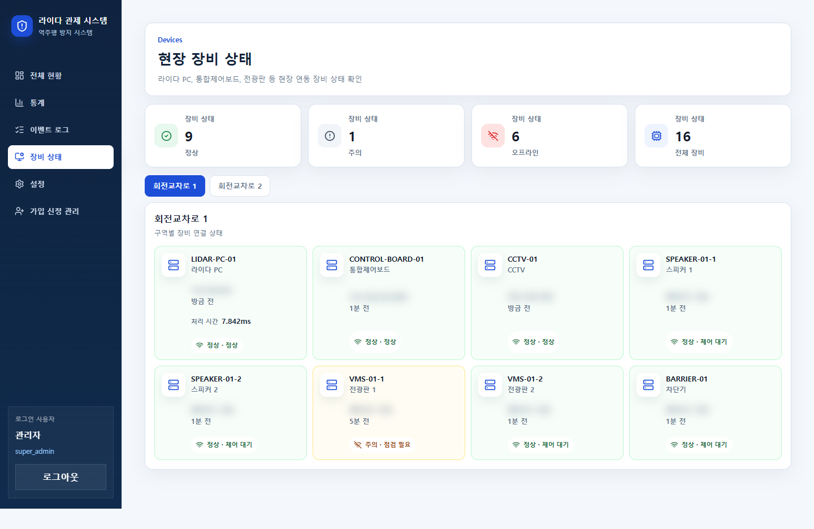
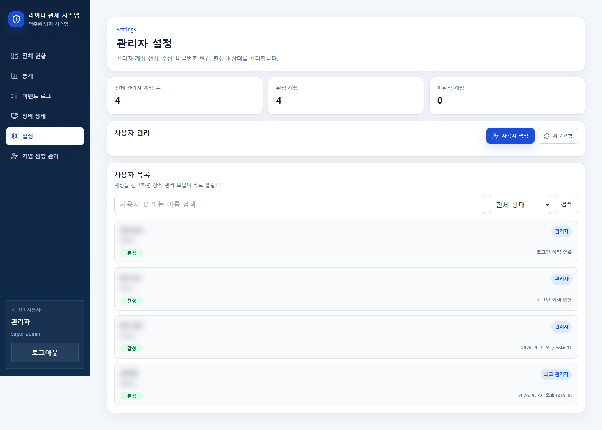
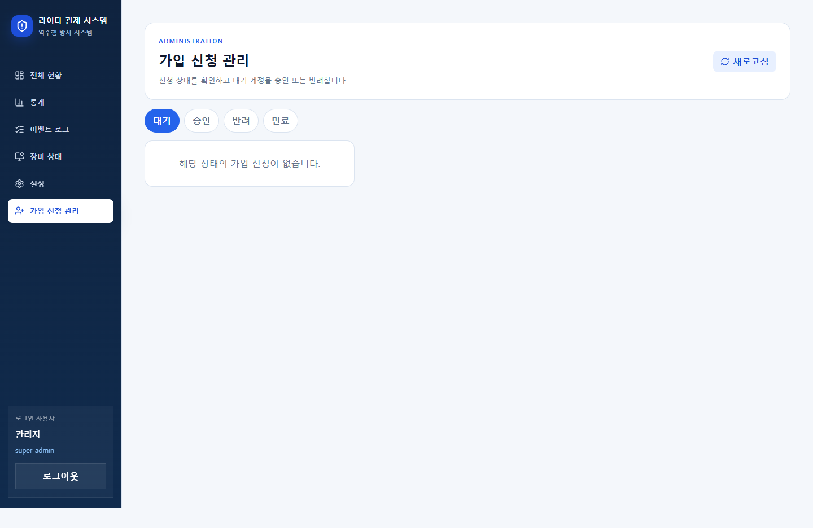
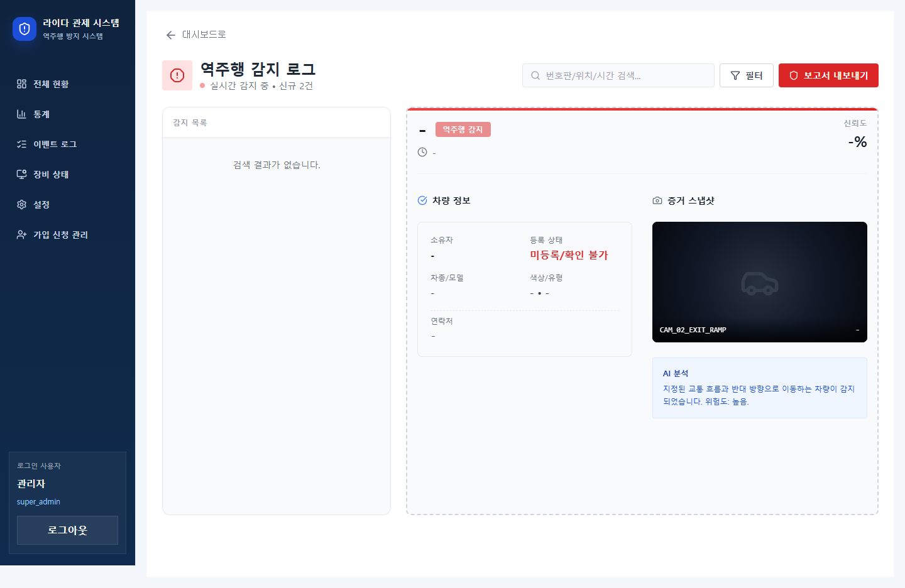
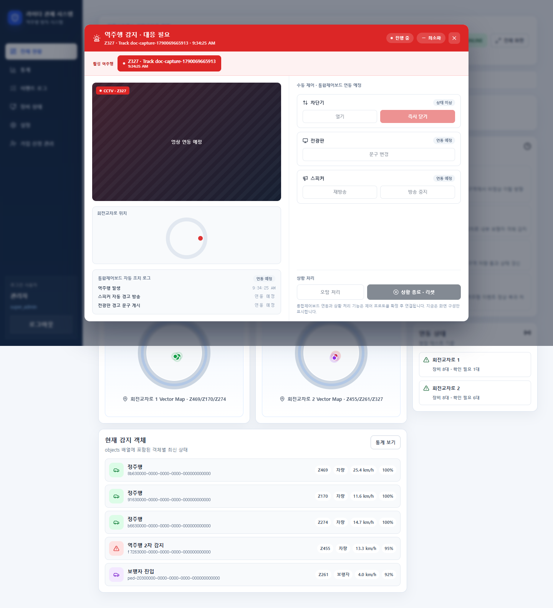

# 라이다 역주행 방지 시스템 개발 현황과 다음 작업

> 작성일: 2026-09-22  
> 확인 기준: `dev` 브랜치 `afc95ae`, 로컬 Docker 개발 환경  
> 용도: 팀 내부 개발 현황 공유 및 현장 연동 작업 계획

## 1. 현재 결론

대시보드의 로그인, 이벤트 수신·저장, 이력 조회, 관리자 화면 등 기본 소프트웨어 흐름은 구현되어 있다. 다만 화면이 열린다는 사실과 실제 현장 관제가 완성됐다는 것은 다르다. 메인 화면의 CCTV·벡터 맵·감지 객체와 장비 상태 화면에는 예시 데이터 또는 연동 예정 표시가 남아 있다. 통합제어보드의 신규 장비별 제어 규격도 확정 전이다.

따라서 다음 단계의 핵심은 화면 추가보다 **실제 라이다 데이터, 영상, 제어보드, 물리 장비를 현장에서 연결하고 안전하게 검증하는 일**이다.

## 2. 확인 범위와 주의사항

- `git pull --ff-only origin dev`로 로컬 `dev`를 갱신했다. 기존 미추적 파일은 변경하지 않았다.
- `docker compose up -d --build`로 PostgreSQL, 백엔드, 프론트엔드를 실행했다. 시작 과정에서 Prisma 마이그레이션 1건과 seed가 적용됐다.
- Chrome 1440x900 화면에서 관리자 계정으로 로그인해 각 메뉴를 열었다. 아래 이미지는 2026-09-22 로컬 개발 DB와 예시 데이터 기준이다.
- 역주행 경고 모달은 관리자용 `POST /api/wrongway/test/mixed-snapshot`으로 **테스트 이벤트 1건**을 생성해 캡처했다. 응답은 `201`, `eventsStored=1`이었다. 이 테스트 데이터는 개발 DB에 남는다.
- 물리 차단기, 전광판, 스피커에 명령을 보내지 않았다. 현장 장비 동작과 안전성은 **미검증**이다.
- 설정 화면의 사용자 이름·ID와 장비 화면의 내부 주소는 캡처에서 흐리게 처리했다.

## 3. 화면별 현황

| 화면 | 확인한 내용 | 현재 한계 |
| --- | --- | --- |
| 로그인 | 로그인 폼과 인증 후 대시보드 이동 확인 | 비밀번호 재설정 이메일의 실제 전달은 확인하지 않음 |
| 전체 현황 | 전체/회전교차로별 탭, KPI, 현장 화면 영역, 객체·이벤트 목록 표시 | 객체·구역별 수치와 CCTV·벡터 맵 상당 부분이 예시 데이터. 화면의 `LIVE`는 실제 영상 연동 완료를 뜻하지 않음 |
| 통계 | 기간·구역 선택, 요약 수치와 차트 표시 | 일부 집계는 API를 사용하지만 구역별 막대그래프 등 예시 통계가 남아 있음. 현장 데이터로 전체 지표 검증 필요 |
| 이벤트 로그 | DB 기반 목록, 검색·필터·정렬·상세·상태 변경 화면 표시 | 실제 관제 업무 흐름과 데이터 보존 기준은 현장 검증 필요. 캡처에는 기존 개발 DB 이력이 보임 |
| 장비 상태 | 구역 탭과 장비 카드 표시 | `deviceGroups` 상수 기반 예시 상태. 표시된 정상·오프라인 수는 실제 장비 진단 결과가 아님 |
| 설정 | 사용자 목록·생성·관리 화면 표시 | 캡처는 조회 확인 중심이며 사용자 변경·초기화 작업은 이번에 수행하지 않음 |
| 가입 신청 관리 | 관리자 메뉴와 상태별 목록 표시 | 이번 캡처 시 대기 신청 0건. 실제 이메일 인증·승인 전 과정은 미검증 |
| 역주행 감지 로그 | 별도 경로의 이전 화면 표시 | 메인 탐색 메뉴에는 없다. 화면은 목록을 배열로 가정하지만 현재 이력 API는 `data.items`를 반환하므로 목록 연결을 수정하거나 화면을 정리해야 한다. 화면의 일부 문구와 상세 정보도 예시값이다 |
| 역주행 경고 모달 | 테스트 이벤트 수신 후 자동 표시 확인 | CCTV 영상은 미연동. 차단기·전광판·스피커·상황 처리 버튼은 비활성 상태 |

### 로그인

### 전체 현황

### 통계

### 이벤트 로그와 상세

### 장비 상태

### 설정

### 가입 신청 관리

### 역주행 감지 로그

이 화면은 현재 주 메뉴의 **이벤트 로그**와 별개인 이전 경로다. 캡처의 `신규 2건` 문구나 차량 상세 예시는 실제 DB 건수의 증거로 사용하지 않는다.

### 역주행 발생 시 경고 모달

## 4. 백엔드 개발 현황

| 영역 | 확인한 구현 | 남은 검증·결정 |
| --- | --- | --- |
| 라이다 HTTP 수신 | `/api/wrongway`가 다중 객체 `objects` 스냅샷을 adapter로 변환하고, source별 순서 보장 후 DB 트랜잭션에서 처리 | 라이다 PC 실제 payload와 시간 지연·중복·누락·동시 객체 시험 |
| 트랙·사건·이벤트 | 차량 트랙 상태, 역주행 사건·이벤트 이력, 일별 집계 저장 로직 존재 | 객체 ID 소실, 재진입, 상황 종료 조건을 현장 데이터로 검증 |
| 실시간 알림 | 역주행 이벤트 저장 후 WebSocket `dashboard-event`를 방송하고 모달에 반영 | 연결 끊김·재접속·다중 관제 화면에서 일관성 확인 |
| 관제 API | 이벤트 목록·상세·상태 변경 및 통계 API 존재 | 운영 역할별 권한과 장기간 데이터 성능 확인 |
| 계정 관리 | 로그인, JWT 인증, 관리자 기능과 비밀번호 재설정 관련 코드 존재 | 실제 메일 발송, 계정 복구 및 운영 설정 검증 |
| 제어보드 | 관리자용 명령 API와 기존 프로토콜 코드 존재 | 신규 장비 ID·명령·ACK·CRC·상태 회신 규격 확정 전. 실제 장비 제어 완료로 볼 수 없음 |

## 5. 앞으로 해야 할 일

### P0. 현장 연동과 안전 기준 확정

1. **라이다 PC 입력 규격 고정:** 실제 샘플 파일을 받고 `source`, `zone_id`, `track_id`, 타입, 타임스탬프, 빈 배열, 재전송 기준을 합의한다. 완료 기준은 현장 샘플이 `/api/wrongway`에 들어가고 객체·사건·통계가 예상대로 남는 것이다.
2. **현장 네트워크·장비 목록 확정:** 장소별 라이다 PC, CCTV, 제어보드, 차단기, 전광판, 스피커의 설치 위치와 네트워크·장비 ID를 대조한다. 완료 기준은 현장 구성표와 실제 연결 결과가 일치하는 것이다.
3. **차단기 안전 동작 합의:** 역주행 오탐, 통신 단절, 정전, ACK 미수신, 수동 개입 때 차단기를 어떻게 유지·복구할지 하드웨어 담당자와 정한다. 이 기준이 정해지기 전에는 자동 차단을 현장에서 활성화하지 않는다.
4. **제어 프로토콜 확정:** 장비별 ID, 명령 바이트, 프레임 길이, CRC, ACK, 타임아웃, 재시도, 상태 조회, 전체 해제 절차를 문서로 승인받는다. 이후 기존 API/adapter와 새 규격의 차이를 반영한다.

### P1. 실데이터와 관제 화면 연결

5. **CCTV 영상 연결:** 구역별 실제 영상 주소, 인증, 지연, 끊김 처리와 저장·보존 정책을 확인한다. 완료 기준은 대시보드와 경고 모달에서 해당 구역 영상이 안정적으로 표시되는 것이다.
6. **예시 데이터 교체:** 전체 현황의 객체·구역별 KPI, 장비 상태, 통계 구역별 그래프를 실제 API 및 실시간 상태와 연결한다. 데이터가 없거나 오래됐을 때 `미수신`으로 표시하고 예시값을 실제값처럼 보여주지 않는다.
7. **사건 처리 흐름 연결:** 경고 수신, 관리자 확인, 조치 이력, 상황 종료와 제어보드 복구 요청을 구분한다. DB 관리 상태 변경이 물리 장비 동작과 혼동되지 않도록 한다.
8. **이전 역주행 로그 화면 정리:** `/dashboard/wrongway`를 계속 사용할지 결정한다. 유지한다면 현재 이력 API의 `data.items` 응답에 맞춰 목록·상태·상세값을 연결하고, 사용하지 않는다면 메인 이벤트 로그로 통합한다.

### P2. 현장 시험과 납품 준비

9. **통합 시험:** 정상 차량 복수, 역주행 차량 복수, 동시 존재, 객체 ID 변경, 지연·중복 전송, 네트워크 단절, 장비 무응답을 순서대로 재현한다. 입력·DB·화면·보드 응답·실제 장비 동작을 한 시험표에 기록한다.
10. **성능·보존 검증:** 실제 카메라 채널 수로 추론 FPS, CPU/NPU 사용량, HTTP 처리량, DB 증가량과 영상 저장 기간을 측정한다. 저장 용량은 현장 녹화 방식이 정해진 후 다시 산정한다.
11. **운영 문서 작성:** 설치·시작·백업·복구·장애 대응·관제자 사용법·검수 결과와 버전 목록을 납품 문서로 정리한다.

## 6. 검증 결과와 미검증 항목

- `git pull --ff-only origin dev`: 성공, HEAD `afc95ae`.
- `docker compose up -d --build`: 성공. PostgreSQL, 백엔드, 프론트엔드 기동 확인.
- `docker compose exec -T backend npm test`: **71개 통과, 실패 0건**.
- `docker compose exec -T frontend npx eslint src`: 통과.
- `docker compose exec -T frontend npm run lint`: 실패. 추적되지 않은 디자인 참고 폴더의 `support.js`에서 오류 6개와 경고 1개가 나왔다. 앱 `src` 린트 결과와 구분해야 한다.
- 브라우저 확인: 로그인과 위 화면 8개를 열었고, 역주행 테스트 이벤트로 경고 모달 표시를 확인했다. 페이지 런타임 오류는 캡처 중 관찰되지 않았다.
- **미검증:** 실제 라이다 PC, CCTV 영상, 통합제어보드와 물리 장비 동작, 이메일 발송, 장시간 연속 운전, 현장 안전 시험.

> 이 문서는 로컬 개발 환경의 특정 시점 상태를 기록한다. 실제 현장 연동 완료 또는 납품 검수 통과를 의미하지 않는다.
