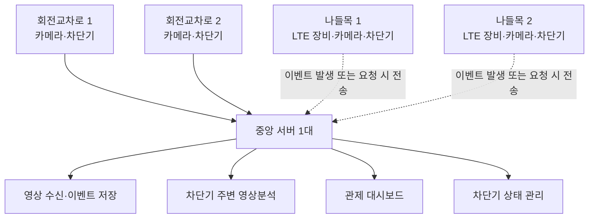

# 라이다 역주행 방지 시스템 회의 정리 및 장비 구매 검토

> 작성일: 2026-08-31  
> 참여자: 태연, 유빈, 부장님

## 1. 문서 목적

라이다 역주행 방지 시스템의 중앙 관제 서버, 카메라, 저장장치 및 현장 통신 장비에 대한 회의 결과를 정리하고 견적 요청 기준을 마련합니다. 아래 내용은 구매 확정서가 아닌 초기 검토안이며, 실제 견적은 현장 조건과 영상 설정을 확인한 뒤 확정합니다.

## 2. 핵심 요구사항

### 확정된 방향

- 중앙 서버 1대에서 회전교차로 2곳과 나들목 2곳, 총 4곳을 관제합니다.
- 차단기는 총 6개를 기준으로 검토합니다.
- 영상분석을 하지 않는 경우 카메라 4대, 영상분석을 적용하는 경우 카메라 10대를 기준으로 견적을 비교합니다.
- 영상분석은 모든 카메라가 아닌 차단기 주변 카메라를 중심으로 수행합니다.
- 나들목 2곳은 LTE 통신을 사용합니다.
- LTE 구간은 영상을 상시 전송·저장하지 않고 역주행 발생 또는 관리자의 요청이 있을 때 이미지나 영상 클립을 서버로 전송합니다.
- 야간 관제를 고려해 IR 기능이 있는 IP 카메라를 우선 검토합니다.

### 추가 확인이 필요한 내용

- 영상 보관기간을 15일과 30일 중 어느 기준으로 확정할지
- 카메라별 해상도, 프레임률, 평균 비트레이트
- 40TB가 장착 용량인지, RAID 적용 후 실제 사용 가능 용량인지
- 영상분석 적용 범위와 최종 카메라 수량
- LTE 이벤트 영상의 길이, 화질, 일일 예상 전송 건수와 통신요금
- 차단기 6개의 제어 방식과 I/O 또는 릴레이 모듈 규격
- 현장별 네트워크, 전원, 방수함 및 설치 공사 범위

## 3. 시스템 구성 방향

회전교차로와 나들목의 이벤트 및 장비 상태는 중앙 서버에서 통합 관리합니다. 나들목 LTE 구간은 통신비와 전송 안정성을 고려해 상시 영상 저장 대상에서 제외하고, 이벤트 기반 자료만 중앙 서버로 전송하는 구조를 우선 검토합니다.

## 4. 서버 PC 권장 사양

| 구분 | 영상분석 고려 권장안 | 영상분석 최소화안 |
| --- | --- | --- |
| CPU | Intel Core i7 13세대 이상 또는 Ryzen 7급 | Intel Core i5급 이상 |
| RAM | 32GB 이상, 가능하면 64GB | 32GB |
| GPU | NVIDIA RTX 4060 이상 | NVIDIA RTX 3060 또는 RTX 4060 |
| 시스템 SSD | NVMe 1TB | NVMe 1TB |
| 영상 저장장치 | HDD 총 40TB급 구성 | 실제 카메라 수와 보관기간에 따라 조정 |
| 네트워크 | 2.5GbE 권장 | 1GbE 이상, 트래픽 산정 후 확정 |
| 운영체제 | Ubuntu 22.04 또는 Windows + Docker/WSL 검토 | 동일 |

RTX 4060급 사양은 차단기 주변 카메라의 컴퓨터 비전 분석과 관제 서비스를 한 서버에서 운영하는 상황을 고려한 기준입니다. 분석 카메라 수, 모델 크기 또는 동시 처리량이 늘어나면 GPU와 전원 용량을 다시 산정해야 합니다.

## 5. 저장장치 산정

H.265 영상의 평균 비트레이트가 일정하다고 가정한 대략적인 계산입니다. 실제 사용량은 장면 움직임, 프레임률, 해상도, 녹화 방식에 따라 달라집니다.

| 카메라 수 | 카메라당 비트레이트 | 보관기간 | 예상 영상 용량 |
| ---: | ---: | ---: | ---: |
| 4대 | 4Mbps | 15일 | 약 2.6TB |
| 4대 | 8Mbps | 15일 | 약 5.2TB |
| 10대 | 4Mbps | 15일 | 약 6.5TB |
| 10대 | 8Mbps | 15일 | 약 13TB |
| 10대 | 8Mbps | 30일 | 약 26TB |

영상 원본 외에도 파일 시스템, 검색 인덱스, 이벤트 클립, 장애 대응 여유 공간이 필요하므로 계산값의 약 1.3~1.5배를 확보하는 것이 좋습니다. 기존 PTZ 카메라 2대에 40TB를 검토한 사례도 있으므로, 초기 견적은 총 40TB급 저장장치를 기준으로 요청하는 것이 무난합니다.

단, RAID를 적용하면 장애 대응력은 높아지지만 실제 사용 가능 용량은 장착된 HDD 총합보다 줄어듭니다. 견적서에는 장착 용량과 실제 사용 가능 용량을 구분해 표시하도록 요청해야 합니다.

## 6. IR IP 카메라 구매 기준

| 항목 | 권장 기준 | 검토 이유 |
| --- | --- | --- |
| 해상도 | 4MP 이상 | 차량과 현장 상황 식별 |
| 영상 압축 | H.265 지원 | 저장 용량과 네트워크 사용량 절감 |
| 전원 | PoE 지원 | 전원선과 통신선 구성 간소화 |
| 야간 촬영 | IR 거리 30m 이상 | 야간 차량 및 차단기 주변 확인 |
| 방수·방진 | IP66 이상 | 실외 설치 환경 대응 |
| 스트리밍 | RTSP 지원 | 서버 및 영상분석 프로그램 연동 |
| 형태 | 고정형 Bullet 또는 Dome 우선 | 분석 구도와 기준선 유지 |

PTZ 카메라는 넓은 범위를 원격으로 확인하는 데 유리하지만 촬영 방향과 배율이 바뀌면 영상분석 기준선도 달라질 수 있습니다. 따라서 차단기 주변 영상분석에는 고정형 IR 카메라가 더 안정적이며, PTZ는 넓은 현장 확인이 별도로 필요할 때 보조 관제용으로 검토합니다.

## 7. 구매 필요 장비

| 장비 | 수량 | 용도 및 비고 |
| --- | ---: | --- |
| RTX 4060급 서버 PC | 1대 | 영상 수신, 이벤트 저장, 영상분석, 대시보드 운영 |
| HDD 총 40TB급 저장장치 | 1식 | 영상 및 이벤트 클립 저장, RAID 구성 별도 확인 |
| IR IP 카메라 | 4대 또는 10대 | 영상분석 미적용·적용 시나리오별 비교 견적 |
| PoE 스위치 | 8포트 또는 16포트 | 카메라 수량과 예비 포트를 고려해 선택 |
| 산업용 LTE 라우터 | 2대 | 나들목 2곳 이벤트 기반 통신 |
| 차단기 I/O 또는 릴레이 모듈 | 6개 | 차단기 상태 확인 및 제어 연동, 규격 확인 필요 |
| UPS | 1대 | 중앙 서버와 핵심 네트워크 장비의 정전 대응 |
| 방수함·랜케이블·전원 부자재 | 1식 | 현장 설치 및 배선 |

## 8. 견적 요청 권장 방식

동일 조건에서 다음 두 가지 안을 구분해 견적을 요청합니다.

1. 기본 관제안: 카메라 4대, 영상분석 최소화, 15일·30일 저장 용량 비교
2. 영상분석안: 카메라 10대, 차단기 주변 카메라 영상분석, 15일·30일 저장 용량 비교

두 안 모두 서버, 40TB급 저장장치, 네트워크 장비, LTE 라우터, UPS와 설치 부자재를 포함하되 카메라 수량과 서버 연산 사양을 구분합니다. 견적서에는 장비 가격뿐 아니라 설치비, LTE 통신비, 유지보수 범위와 보증기간도 별도로 표시하도록 요청합니다.

## 9. 다음 진행사항

- 카메라 설치 위치와 실제 촬영 거리 확인
- 4대·10대 구성별 영상분석 대상 확정
- 15일·30일 보관 기준별 저장장치 견적 비교
- LTE 이벤트 클립 전송 정책과 예상 통신비 산정
- 차단기 연동 모듈 규격 및 제어 책임 범위 확인
- 서버 및 카메라 공급업체에 동일 조건으로 비교 견적 요청

